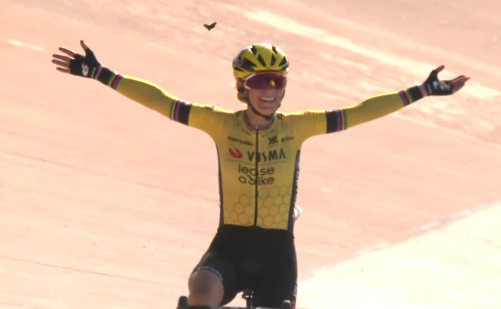

  

# Imitation is experience; imitation is life.

Looking up to an older sibling, doing everything just like big bro!

An apprentice imitating the master in skill and style before he develops his own.

The problem-solving blueprint in a very-special-episode of your favorite show.

Gentle onanism in accompaniment with a video, one's own touch bringing the seen to the felt.

Imitation is a shortcut to know more than you could on your own. We have the power of language, we have the battery of record.

We can watch a movie, read a book, feel the pain and struggle of imaginary others. Stories are reality and reality becomes story. The best stories are real, visceral, full of grit and glory, heartbreak and defeat.

There is a story that plays out each Spring on cobblestone roads meant for Napoleonic cart traffic. A gritty bicycle race across the North of France, that includes the treacherous Trouée d'Arenberg. A race that demands supplication from its would-be champions, beats their bodies, and tramples souls.

No climbs, only cobbles; mud if we're lucky. Carbon fiber wheels shatter on stone corners once trod by a doomed French army.

It is a working man's race in spirit, partly crafted by the miners who toiled along its route, and escaped their darkness to fly free on a bicycle. This race is for the hard men, and more recently women, of the Peloton, for them to break themselves on its stoic face. The struggle is the point. The mud, the rocks, the pain, are a crucible. One simply cannot hold on to pretense under such an assault. The vainqueure is a survivor both strong and lucky. In the end we are witness to a vision of divine *souplesse*: arms outstretched in benevolence as butterflies greet her triumph.

She is not us. We are, just us. Watching a screen while astride our castrated steeds made stationary in our living rooms. A flywheel, a fan, a streaming subscription. We are free to flay our own bodies by proxy.

Sometimes this can be close enough, hard enough. Choosing a hard thing can lead to escape, choosing a soft thing, perhaps denial.

Sometimes I need a lot of discomfort. Sometimes I need to struggle until my body protests and goes on strike. Sometimes I push until just before Doodle's heart breaks. And then I am fleetingly free.

For nearly three months I was made to ride my bike inside as I healed a broken bone. Watching sporting heroes flying on two wheels following black ribbon roads worlds away. I can experience some of what they do in imitation.

I will never ride the Paris-Roubaix. But when I watch it from my bike in my living room I can map my pain and struggle on to what I see in those riders' faces and bodies. Their mud caked faces, torn kit and hollow eyes.

I can learn, I experience by proxy and imitate. Life is still there, not made less real by the screen, but enriched by it.

Pain can focus. Good pain can hone. If we're lucky we can choose some of our pain. We all have pain we cannot. It can defeat us, cake us in the mud of life's struggles, break us on the rocks of heartbreak, and still, we won't win. It is hard, it is meant to be hard, and yet I ride.

The [Paris-Roubaix](https://www.paris-roubaix.fr/en/) and [Paris-Roubaix Femmes](https://www.paris-roubaix-femmes.fr/en) will be contested this coming Sunday, April 12, 2026. The winner receives a rock.
